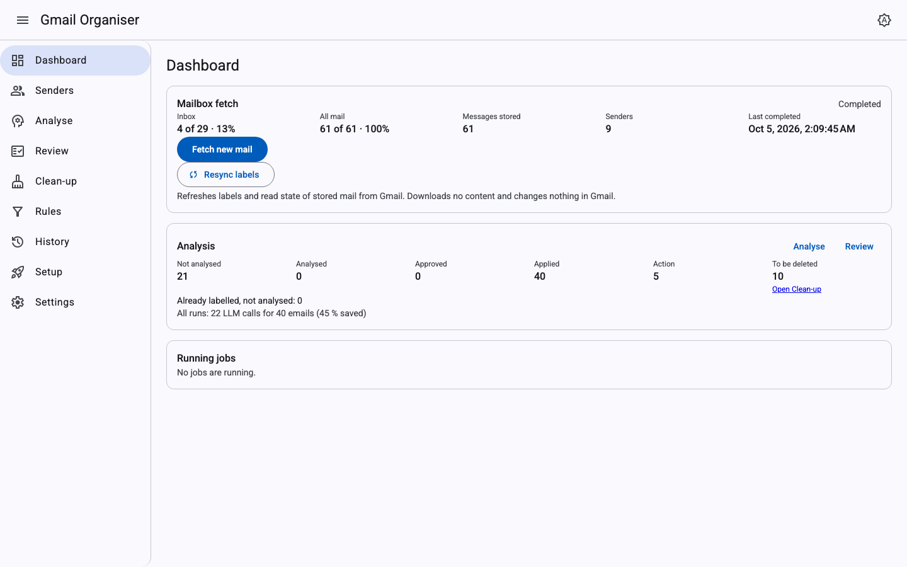
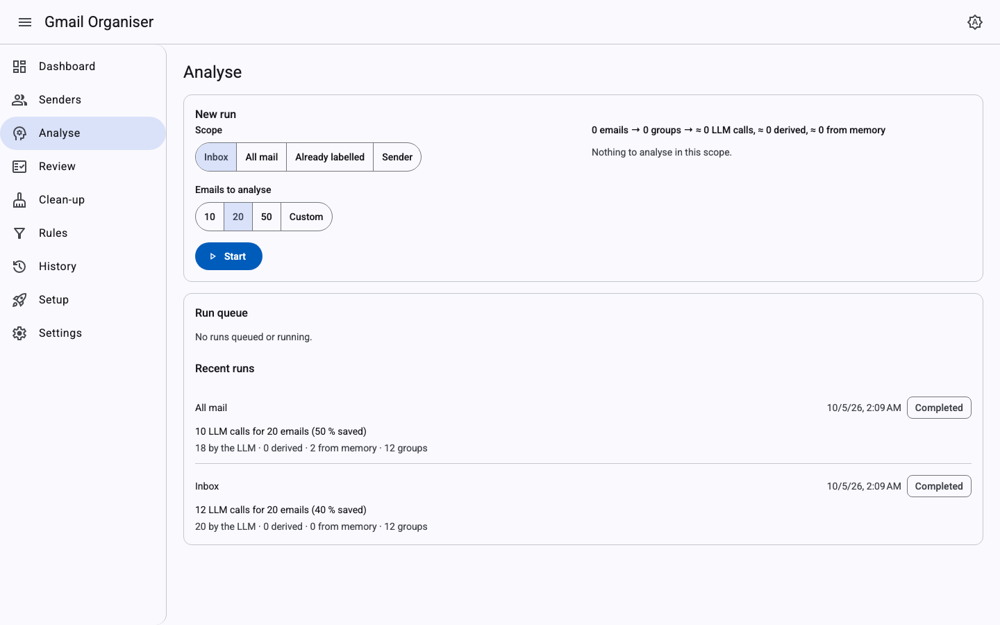
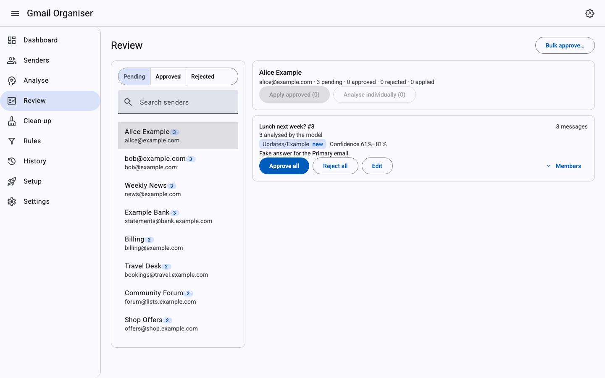
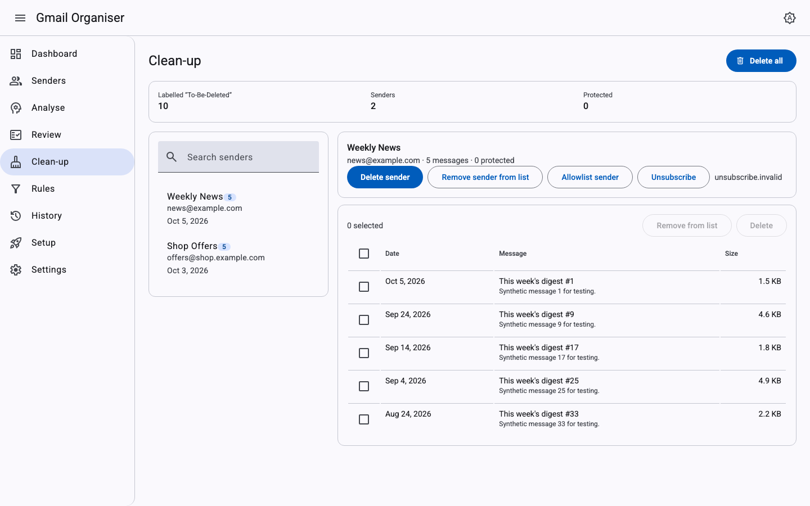
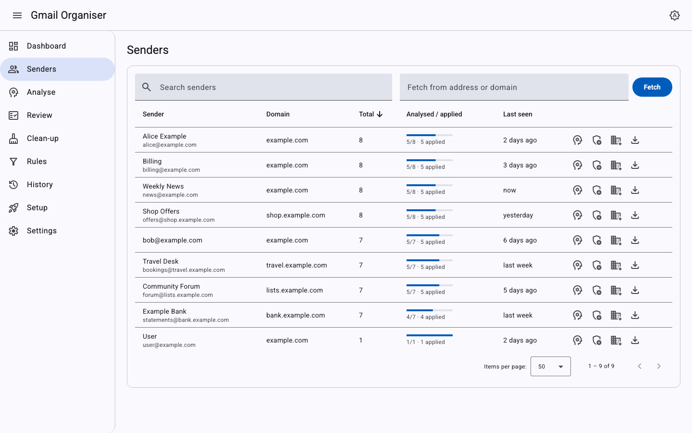
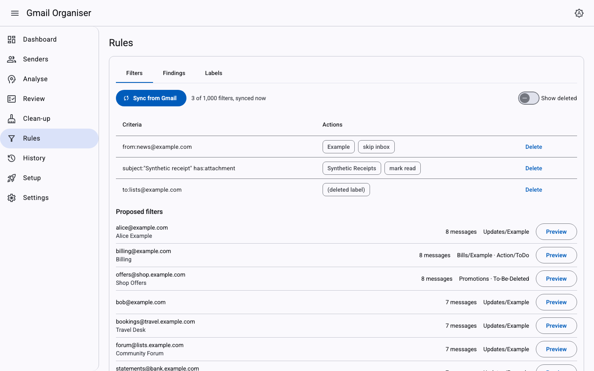
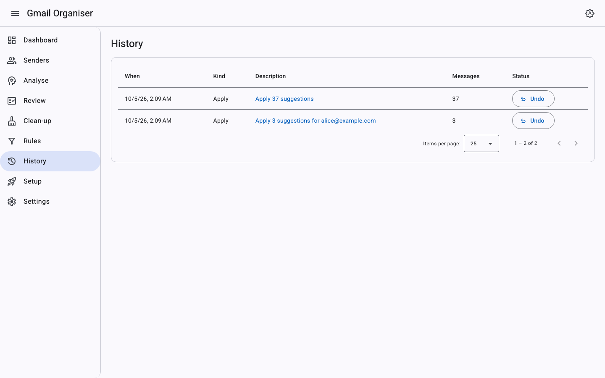
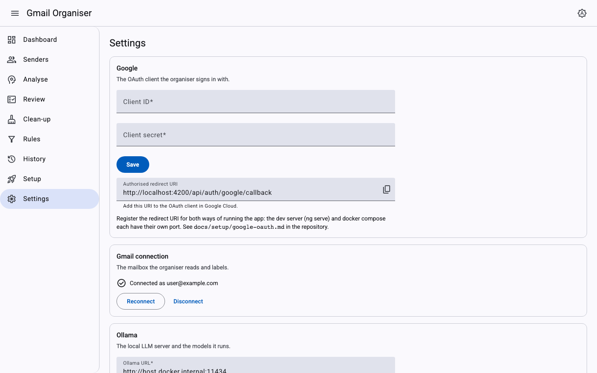

# Gmail Organiser

A self-hosted, single-user Gmail organiser. A local LLM running in [Ollama](https://ollama.com/) reads your mail in
batches you start, and suggests labels, clean-up of low-value mail and Gmail filters. You review every suggestion and
approve what gets applied. It runs on your own machine with your own Google Cloud project; an optional second opinion
from Claude (over MCP) can check the local model's suggestions, filter findings and label plans.

## Safety promises

- **Never deletes.** Mail that could go is only labelled `To-Be-Deleted`. "Delete" moves it to Gmail's Trash, which
  Google keeps for 30 days. The app never asks for the full-mail scope that would allow permanent deletion; it uses
  only `gmail.modify`, `gmail.settings.basic` and `gmail.labels`.
- **You approve every change.** The LLM only suggests. Labels, archiving, Trash and filters are applied after you
  approve them, and every applied change is logged so it can be undone.
- **Local only.** The web UI is bound to `127.0.0.1`, the LLM runs on your host, and your OAuth client, tokens and
  mail stay on your machine. Secrets are kept in `.env` or encrypted in the local database.

## Screenshots

All images show the synthetic `example.com` mailbox of the fake development stack, not real mail.

| | |
|---|---|
|  |  |
|  |  |
|  |  |
|  |  |

## Quick start (Docker compose)

Requirements: Docker with compose, Ollama on the host ([Ollama setup](docs/setup/ollama.md)), and a Google OAuth
client of your own ([Google OAuth setup](docs/setup/google-oauth.md)).

```bash
cp .env.example .env            # optional: edit ports, Google client ID/secret, Ollama URL
docker compose up -d --build
```

In Rider, the shared run configurations `docker-publish` (build and start the stack) and `docker-stop-app` (stop
`api` and `web`, keeping `db` for IDE runs) do the same. Stop the IDE-run API before `docker-publish`: only one API
may use the database.

If you change `WEB_PORT`, set `APP_BASE_URL` to the same port too (e.g. `http://localhost:5280`): the Google
redirect URI is built from `APP_BASE_URL`, and a mismatch makes Google reject sign-in with `redirect_uri_mismatch`.

Open <http://localhost:5180> (or your `WEB_PORT`) and run the setup wizard: enter your Google OAuth client, connect
Gmail, point the app at Ollama and choose your models.

Optional second opinion from Claude (headless Claude Code or Claude Desktop): [Claude review setup](docs/setup/claude-review.md).

Only the `web` container is published, on `127.0.0.1:${WEB_PORT:-5180}`; `api` and `db` stay on the compose network.
Data lives in the `db-data` and `dp-keys` volumes (`dp-keys` holds the key that encrypts your Google token; keep it
with the database).

### Run published images

To skip building from source, set the image variables in `.env` (replace `<owner>` with the GitHub owner of the
repository you run from):

```bash
API_IMAGE=ghcr.io/<owner>/gmail-organiser-api:latest
WEB_IMAGE=ghcr.io/<owner>/gmail-organiser-web:latest
```

then `docker compose pull && docker compose up -d`. Images are built for `linux/amd64` and `linux/arm64`. If the
packages are private, `docker login ghcr.io` first.

Releasing: `git tag vX.Y.Z && git push origin vX.Y.Z` publishes `X.Y.Z`, `X.Y` and `latest`; a manual run of the
Publish workflow publishes `sha-<short>` and the branch name.

## Development from the IDE

Requirements: .NET SDK 10 (see `global.json`), Node per `.nvmrc`, Docker for the dev database.

1. Start the database only, published on `127.0.0.1:5432`:

   ```bash
   docker compose -f docker-compose.yml -f docker-compose.dev.yml up -d db
   ```

2. Run the API and the web app:
   - **Rider:** open `GmailOrganiser.slnx`, run the `GmailOrganiser.Api` profile, then `npm start` in `src/web`
     (or the shared `Web: npm start` run configuration).
   - **VS Code:** run the `API + Web` compound launch configuration.
   - **Terminal:** `dotnet run --project src/api --launch-profile GmailOrganiser.Api`, and `npm ci && npm start` in
     `src/web`.

3. Open <http://localhost:4200>. `ng serve` proxies `/api`, `/hubs` and `/mcp` to the API on `http://localhost:5181`.

The `GmailOrganiser.Api` profile sets `GMAIL_FAKE=true`, so the IDE run uses a synthetic in-memory mailbox
(`example.com` senders) and needs no Google login. It uses Ollama at `http://localhost:11434`. `dotnet run` does not
read `.env`; to connect a real account from the IDE, see [Google OAuth setup](docs/setup/google-oauth.md#5-enter-the-client-id-and-secret).

**Parallel worktrees / a second stack:** give each its own compose project name and ports, for example
`docker compose -p gmo-test -f docker-compose.yml -f docker-compose.dev.yml up -d db` with `DB_PORT` and `WEB_PORT`
set. A non-default `DB_PORT` only moves the published port: the IDE-run API still connects to `Port=5432` from
`appsettings.Development.json`, so export the matching connection string in the API's environment too:

```bash
ConnectionStrings__Default="Host=localhost;Port=$DB_PORT;Database=gmail_organiser;Username=gmo;Password=gmo_dev_password"
```

Build, test and CI commands: [docs/ci.md](docs/ci.md).

## Documentation

- [Google OAuth setup](docs/setup/google-oauth.md): your own Cloud project, scopes, redirect URIs, publishing to
  "In production".
- [Ollama setup](docs/setup/ollama.md): install, models, `host.docker.internal` on macOS and Linux.
- [Claude review setup](docs/setup/claude-review.md): `WITH_CLAUDE`, `claude setup-token`, Claude Desktop config.
- [Apps Script setup](docs/setup/apps-script.md): daily auto-archive in Google's cloud: paste the script and CONFIG,
  dry run, daily trigger, updates.
- [CI](docs/ci.md): workflows, required checks, build and test commands, end-to-end tests and screenshots.
- [Design](docs/DESIGN.md): architecture, workflows, data model.

## Status (v1.0)

What it does:

- **Fetch** the Inbox or All Mail, then incrementally from Gmail's history.
- **Analyse** mail in batches you start, with a local model in Ollama; re-analyse single emails and compare runs.
- **Review, apply and undo:** approve, edit or discard grouped suggestions; every applied change can be undone.
- **Clean-up** to Trash only, with sender protection and unsubscribe links.
- **Filters and labels:** sync Gmail filters, review them for duplicates and overlaps, review the label structure.
- **Apps Script archiving:** a daily script in your Google account archives handled mail.
- **Claude second opinion** (optional) on suggestions, filter findings and label plans.
- **Settings:** Google client, Gmail connection (reconnect when Google revokes access), Ollama and models.

What it does not do:

- More than one Gmail account (issue #67).
- Permanent deletion: never; "Delete" moves mail to Trash.
- Act on its own: nothing is applied to Gmail without your approval.

## Licence

MIT. See [LICENSE](LICENSE).

Gmail and Google are trademarks of Google LLC. This project is independent and is not affiliated with or endorsed by
Google.
